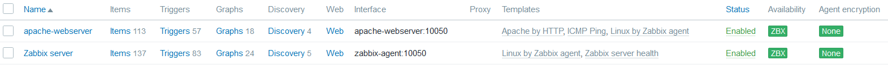

# ObligatorioMonitoreo

- [Introducción](#Introducción)
- [Diagrama](#diagrama)
- [Requerimientos](#requerimientos)
- [Despliegue](#despliegue)
- [Configuraciones](#configuraciones)
- [Pruebas](#pruebas)
- [Mejoras](#mejoras)
- [Problemas](#problemas)
- [Bibliografia](#bibliografia)

## Introducción

## Diagrama

## Requerimientos

Actualizar sistema:

```bash
sudo dnf --refresh update
sudo dnf upgrade
```

## Despliegue 

## Configuraciones

<p align = "center"> 

</p>

## Pruebas

## Mejoras

## Problemas

## Bibliografia

-Material de aulas
-[Zabbix](https://www.zabbix.com/container_images)
-[Grafana-Loki](https://grafana.com/docs/loki/latest/setup/install/docker/)


