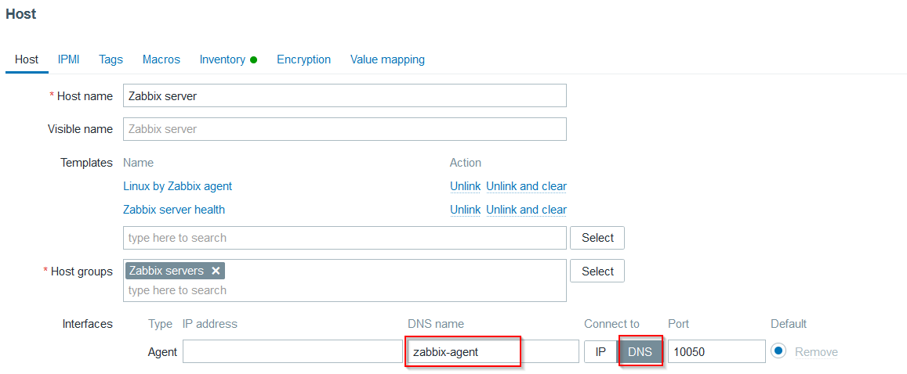

# Trabajo Obligatorio 2024 - Universidad ORT

**Materia:** Monitoreo y Supervisión de Redes  

**Docentes:** Álvaro Sánchez - Carlos Mansilla

**Alumnos:** Diego Docampo (162385) - Santiago Clavijo (174971)

----

## Índice

- [Introducción](#Introducción)
- [Diagrama](#diagrama)
- [Requerimientos](#requerimientos)
- [Despliegue](#despliegue)
- [Configuraciones](#configuraciones)
- [Pruebas](#pruebas)
- [Mejoras](#mejoras)
- [Problemas](#problemas)
- [Bibliografia](#bibliografia)

## Introducción

Este repositorio contiene la documentación y los archivos necesarios para desplegar la infraestructura en Docker utilizada para llevar a cabo el trabajo obligatorio solicitado. El mismo consta de instalar y configurar 2 servidores con aplicaciones que resuelvan el monitoreo de la red y recolección de eventos de syslog. Adicionalmente instalar un servidor web para que sea monitoreado.

Como servidor de monitoreo utilizamos Zabbix, como servidor de syslog utilizamos el stack de grafana-loki-promtail y como servidor web utilizamos apache.
Decidimos desplegar la infraestructura sobre Docker ya que nos brinda ventajas importantes frente al despliegue sobre maquinas virtuales, algunas de ellas son, menor consumo de recursos, tiempo de despliegue, portabilidad, imágenes oficiales, etc. El mayor beneficio que le vimos a Docker es la rapidez con la que desplegamos el ambiente una vez que tenemos las definiciones, esto nos permitió ir generando cambios en el `Docker-compose` compartirlo entre nosotros y en minutos ambos teníamos la última versión de la infra para seguir con las pruebas.

## Diagrama

<p align = "center"> 

</p>

## Requerimientos

Para el despliegue de esta infraestructura es necesario contar con un servidor Linux con los siguientes servicios instalados:

- Docker
- Docker-compose
- Git

**Ejemplo de instalación sobre AlmaLinux 9**

- Instalación Docker:

```bash
dnf config-manager --add-repo https://download.docker.com/linux/centos/docker-ce.repo
dnf update
dnf install docker-ce docker-ce-cli containerd.io
systemctl enable docker
systemctl start docker
```
- Instalación Docker-compose:

```bash
sudo curl -L "https://github.com/docker/compose/releases/latest/download/docker-compose-$(uname -s)-$(uname -m)" -o /usr/bin/docker-compose
chmod +x /usr/bin/docker-compose
docker-compose --version
```

- Instalación Git:

```bash
sudo dnf install git
git --version
```

## Despliegue 

Para el despliegue de la infra es necesario clonar el repositorio de git y ejecutar el docker-compose de la siguiente manera:

- Clonar el repositorio:

```bash
git clone https://github.com/ObligatorioMonitoreo2024/ObligatorioMonitoreo.git
```

- Ejecutar el docker-compose:

```bash
docker-compose up -d
```

[](https://asciinema.org/a/SgtuH7s1maTbFwgra1FIYlaBD)

## Configuraciones

Una vez desplegada la infra procedemos a realizar las configuraciones correspondientes a los monitoreos, para poder acceder a los servicios que están corriendo en los contenedores lo debemos de realizar mediante la ip del servidor linux que corre Docker y en el puerto correspondiente al contenedor según la definición que se realizó en el docker-compose.

**Monitoreo - Zabbix:**

El frontend de zabbix esta expuesto en el puerto 80 por la cual para acceder basta con poner la ip del servidor de docker en el navegador.

<p align = "center"> 

</p>

Las credenciales para el logueo son Admin zabbix.

Una vez logueado podemos ver en el dashboard que tenemos una alerta indicando que el zabbix-agent no está disponible.
Esta alerta es del monitoreo del propio zabbix-server que se realiza mediante el zabbix-agent que se encuentra desplegado en un contenedor aparte.

<p align = "center"> 

</p>

Para resolver esto debemos ajustar la configuración del host de zabbix y especificarle que el monitoreo lo realice mediante el contenedor de zabbix-agent.

Ingresamos en Datacollection - Host.
<p align = "center"> 

</p>

Dentro del host de zabbix-server cambiamos la interface del agente para que utilice dns name zabbix-agent y connect to DNS.
<p align = "center"> 

</p>

Damos update y verificamos que levante el monitoreo por el zabbix-agent.
<p align = "center"> 

</p>

El monitoreo del servidor web lo realizamos mediante el agente zabbix que se desplego en el mismo contenedor personalizado mediante el archivo `dockerfile`. A nivel de zabbix server damos de alta un nuevo host y le asignamos los templates de Apache y Linux. Con el de apache monitoreamos lo relativo al servicio web y con el de linux al sistema operativo (CPU, RAM, Disco, etc).

<p align = "center"> 

</p>

**Notificaciones mediante Telegram**

Para el envío de alertas mediante Telegram se realizaron las siguientes configuraciones:

- Crear bot en telegram mediante BotFather

<p align = "center"> 

</p>

- Crear grupo de telegram con el bot (inicializarlo) y el usuario IDBot para obtener el id del grupo al cual zabbix debe enviar los mensajes

<p align = "center"> 

</p>

- Configurar MediaType en zabbix con los datos obtenidos de ID y token

<p align = "center"> 

</p>

- Habilitar trigger actions para que se envie mensaje al grupo de administradores mediante telegram

<p align = "center"> 

</p>

<p align = "center"> 

</p>

**Syslog:**

La solución de syslog consta de tres componentes:
- Promtail: Agente de recolección de logs para Loki.
- Loki: Sistema de almacenamiento de logs optimizado para grandes volúmenes de datos.
- Grafana: Plataforma de visualización y monitorización que se integra con Loki y otras fuentes de datos para proporcionar dashboards interactivos.

Estas tres herramientas nos permiten realizar una gestión de logs de manera visual y poder generar alertas en base a patrones detectados en los mismos.

La configuración de estas herramientas las realizamos a nivel del docker-compose y se divide en los siguientes pasos:
- Acceso a los logs de apache mediante Promtail.
- Envío de logs desde Promtail a Loki.
- Visualización de datos desde Grafana.

En el contenedor del web server se montó un volumen persistente apuntando a la carpeta de logs de apache (`/var/log/apache2/`) y en el contenedor de Promtail se montó el mismo volumen apuntando a la carpeta `/var/log/` que es desde donde Promatil lee los archivos para enviarle a Loki. En el contenedor de Loki se levanta el servicio en el puerto 3100 y en el despliegue del contenedor de Grafana se realiza el alta del datasource de Loki referenciando al contenedor de Loki desplegado anteriormente.
A nivel de la interface grafica podemos verificar como se encuentra todo configurado.

<p align = "center"> 

</p>

## Pruebas


**Caída de servicio apache**

<p align = "center"> 

</p>

**Consumo alto de CPU**

<p align = "center"> 

</p>

<p align = "center"> 

</p>

<p align = "center"> 

</p>


## Mejoras

- Levantar los contenedores en un ambiente con alta disponibilidad por ejemplo un cluster de kubernetes
- Monitoreo de la infraestructura de docker o cluster de kubernetes

## Problemas

Nos encontramos con un problema en el contenedor del webserver que corre apache, debido a que el mismo no generaba registros en el archivo `/var/log/apache2/error.log` al consultar una página que no existía.
Para resolver esto realizamos los siguientes pasos:
-	Creamos un archivo `httpd.conf` en el directorio donde se encuentra el Dockerfile en el servidor de Docker.
-	A este archivo se le modifico el valor de LogLevel de warm a debug
-	En el archivo Dockerfile se copia el `httpd.conf` local hacia el contenedor en la siguiente ruta `/etc/apache2/httpd.conf`,generando una imagen con el archivo modificado.

## Repositorio

En el siguiente repositorio de [Github](https://github.com/ObligatorioMonitoreo2024/ObligatorioMonitoreo/tree/main) se puede acceder al contenido de este trabajo

## Bibliografia

-Material de aulas
-[Zabbix](https://github.com/zabbix/zabbix-docker)
-[Grafana-Loki](https://grafana.com/docs/loki/latest/setup/install/docker/)
-[DockerHUB-Mysql](https://hub.docker.com/_/mysql)
-[ChatGPT](https://chatgpt.com/)
